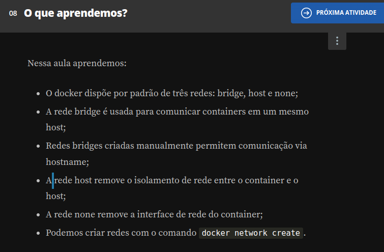

## Comunincando aplicação e banco

Repare abaixo que utilizamos a _**flag -p**_ para em seguida validar o funcionamento da aplicação através de nosso host. que utilizamos a flag -p para em seguida validar o funcionamento da aplicação através de nosso host.

```
docker network ls
docker network create --driver bridge minha-bridge

docker pull mongo:4.4.6
docker pull aluradocker/alura-books:1.0

docker run -d --network minha-bridge --name meu-mongo mongo:4.4.6
docker run -d --network minha-bridge --name alurabooks -p 3000:3000 aluradocker/alura-books:1.0

```

- **Acesse o localhost e popule a tabela**

Em seu navegador, acesse a url localhost:3000 e veja que foi possível carregar a página da aplicação. Para que os dados sejam carregados e armazenados no banco, acesse localhost:3000/seed e, em seguida, recarregue a página localhost:3000. Veja que as informações agora estão sendo exibidas por conta da comunicação entre aplicação e banco de dados.

```
localhost:3000/seed 
localhost:3000

```

