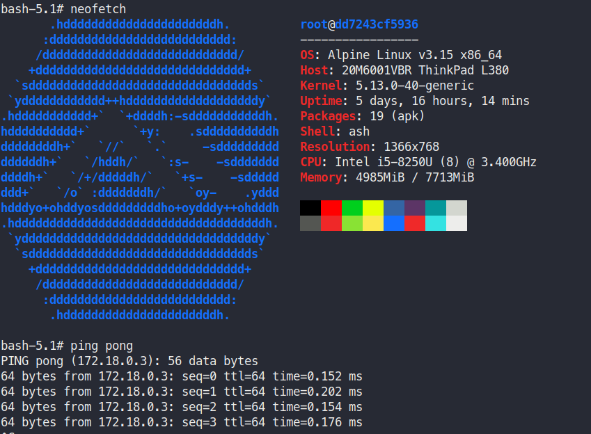

## Listar networks

```
docker network ls

```

## Criar uma rede modo bridge

```
docker network create --driver bridge minha-bridge

```

## Criar container e definir rede

```
docker run -it --name meu-alpine --network minha-bridge alpine /bin/sh

```
- **Conferir minha bridge criada**

```
docker ps
docker inspect <CONTAINER ID>

```

## Fazer comunicações entre containers

- **Rodar dois containers e um container pode ficar em modo detach**

```
docker run -d --name pong --network minha-bridge --rm ubuntu sleep 1d

docker run -it --name meu-alpine2 --network minha-bridge alpine /bin/sh

```
- **Note que criamos um nome para o container pois o docker se encarrega de já criar um DNS automatico**

instale o ping em um dos containers

apk update && apk add iputils-ping

apt update && apt install iputils-ping

```

docker ps
docker inspect <CONTAINER ID>

```

- **Após instalado o ping podemos fazer a brincadeira**

```
ping pong

```


